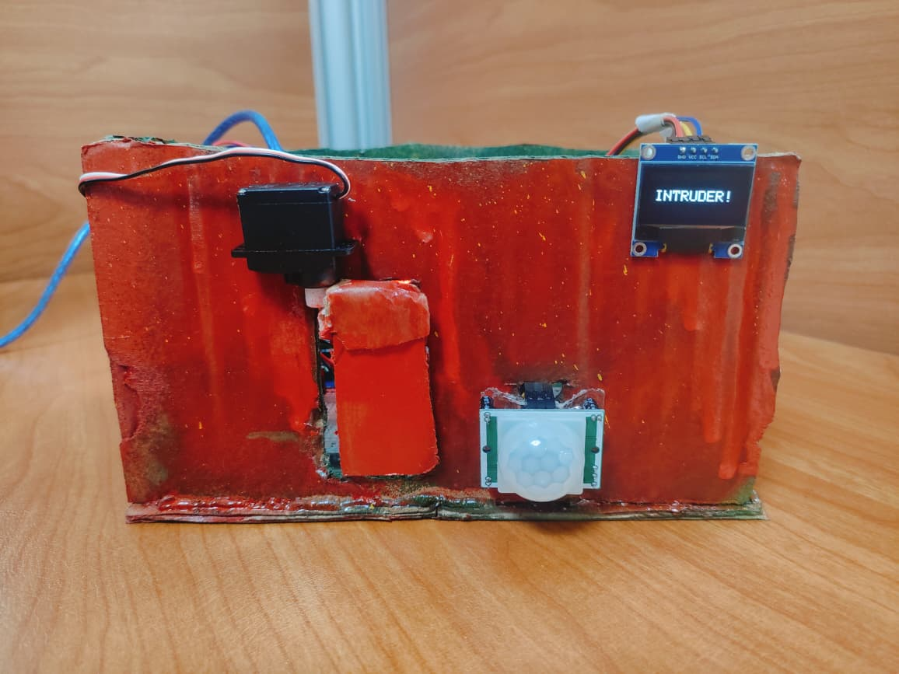
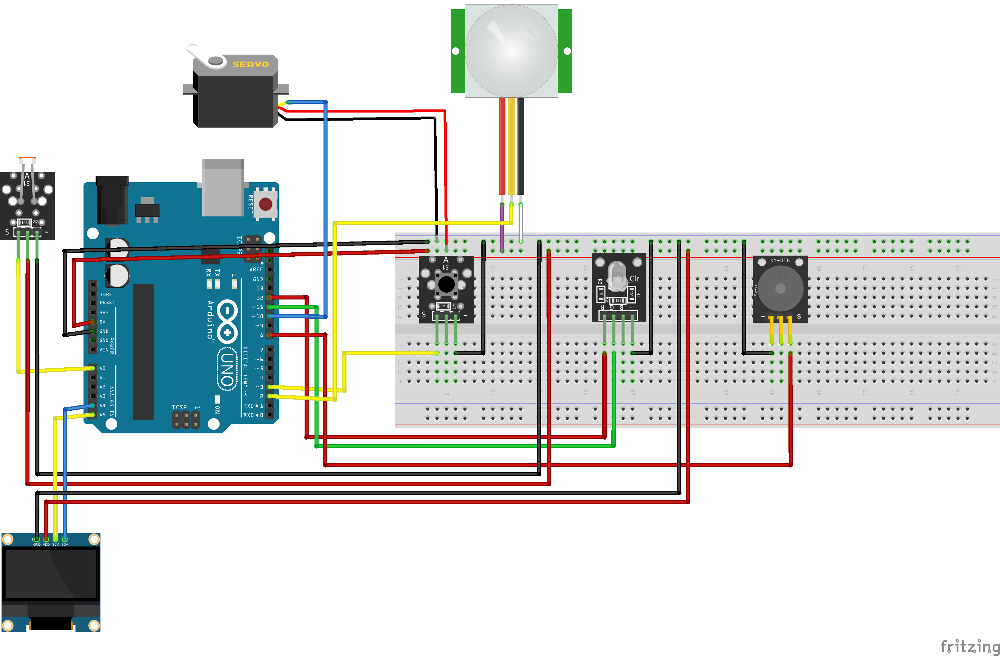
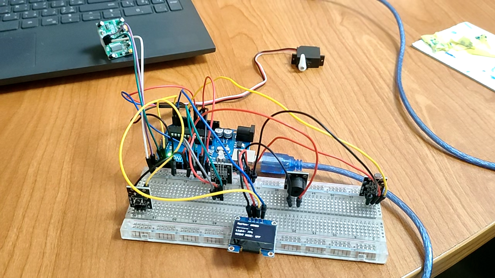
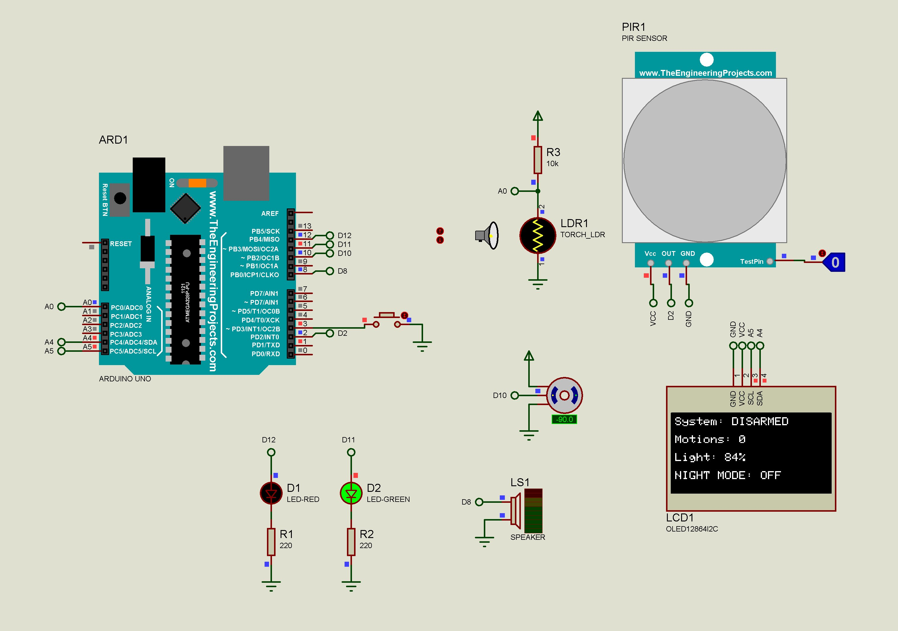
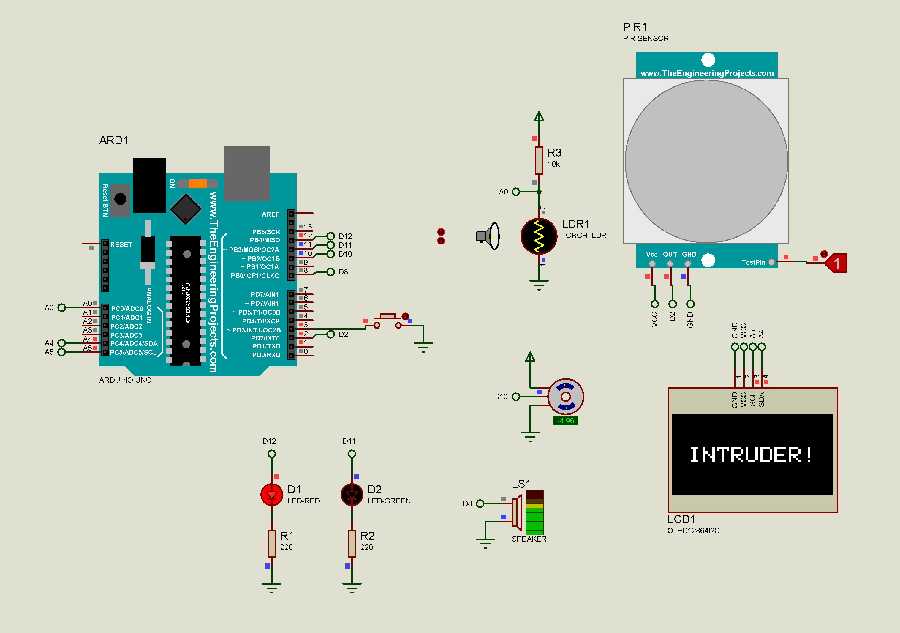
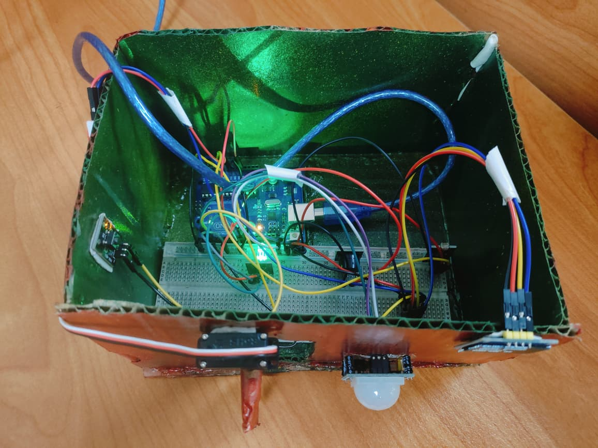
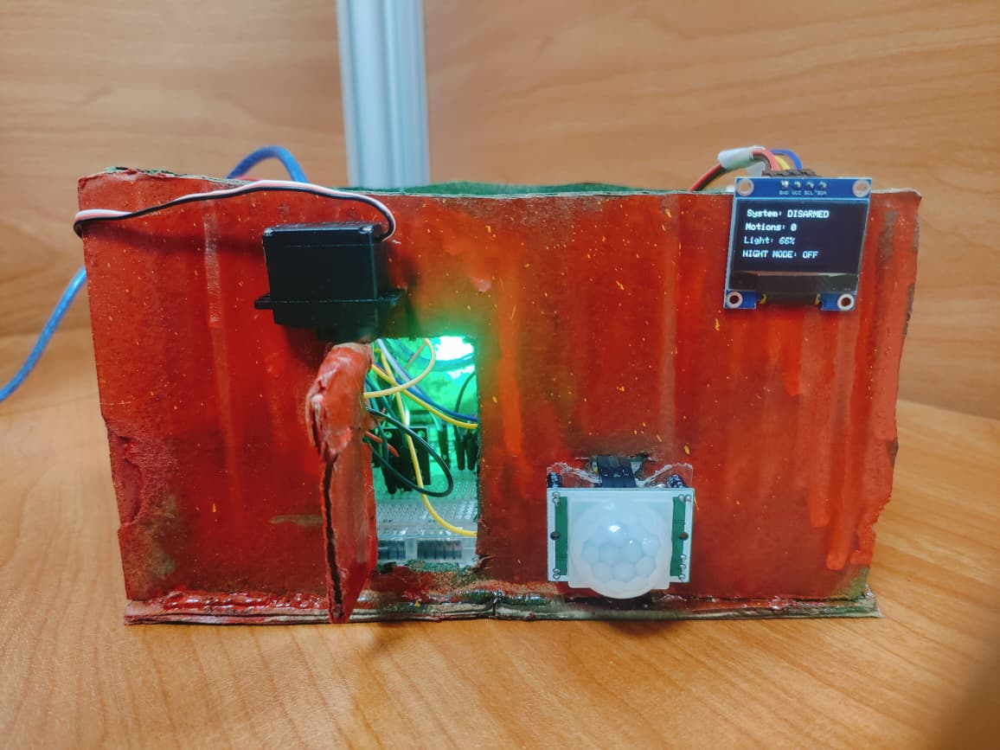

<div align="center">

# 🔐 Motion-Activated Security System

### Arduino-based intrusion detection with live OLED telemetry

 


</div>

> Embedded Systems Hands-On Project | Maker Internship Program 2026
>
> **ITIDA · EME Innovation Labs — Giza · Supervised by Origin Integrated Systems (OIS)**

A dual-state **ARMED / DISARMED** Arduino security system combining PIR motion sensing, ambient light monitoring, hardware-interrupt mode switching, a servo-actuated deadbolt, a piezo buzzer, an RGB status LED, and a live SSD1306 OLED telemetry dashboard.



> [!IMPORTANT]
> In **ARMED** mode, motion activates the red alert LED, locks the servo deadbolt, sounds a 1 kHz siren, and displays `INTRUDER!` on the OLED.

## 👥 Team

- Islam Ahmed Nabil Asar
- Mai Mohamed Fawzy Ali
- Abdallah Hassan Abu Al-Naaman

## 🧭 Overview

The system monitors a protected area using a PIR sensor and reacts differently depending on whether it is **ARMED** or **DISARMED**:

- 🚨 **ARMED** — any detected motion triggers a full intrusion response: red LED on, deadbolt servo locks to 90°, a continuous 1 kHz siren sounds, and the OLED shows a large `INTRUDER!` warning. The motion counter increments and the alert holds for 3 seconds before resetting.
- 🟢 **DISARMED** — the system idles safely (green LED on, deadbolt open). If ambient light drops below 20% ("Night Mode"), any detected motion triggers a courtesy double-beep instead of an alarm.

Mode switching is handled entirely through a hardware interrupt on the push button, with software debouncing to prevent false triggers.

## ✨ Features

- 🔁 **Dual operational states** (ARMED / DISARMED) toggled via an external interrupt (`INT1`, falling edge)
- 📈 **Rising-edge motion discrimination** — counts each motion event once, even during sustained PIR presence
- 💡 **Adaptive day/night light logic** — LDR reading mapped to a 0–100% illumination scale, with a Night Mode threshold below 20%
- 🚨 **Multi-modal intrusion alarm** — simultaneous red LED, servo deadbolt lock, 1 kHz siren, and OLED warning splash
- 📟 **Live OLED telemetry** — current state, motion count, light %, and night-mode status
- 🛡️ **Software-debounced interrupt** — 50 ms `micros()`-based lockout eliminates button contact chatter
- 🧹 **State-resetting event log** — motion counter resets automatically each time the system is armed

## 🔧 Hardware / Bill of Materials

| Component | Interface | Pin | Role |
|---|---|---|---|
| Arduino Uno R3 (ATmega328P) | Core controller | — | Central processing & timing |
| HC-SR501 PIR motion sensor | Digital input | D2 | Human motion detection |
| Tactile push button | Digital input (`INPUT_PULLUP`) | D3 (INT1) | Hardware-interrupt mode toggle |
| Passive piezo buzzer | PWM / `tone()` | D8 | Alarm siren & courtesy beeps |
| SG90 micro servo | PWM servo control | D10 | Electronic deadbolt (0°–90°) |
| RGB LED — green channel | Digital output | D11 | Disarmed / safe indicator |
| RGB LED — red channel | Digital output | D12 | Intrusion alert indicator |
| KY-018 LDR photoresistor module | Analog input | A0 | Ambient light level |
| 0.96" SSD1306 OLED (128×64) | I2C | SDA: A4, SCL: A5 (addr `0x3C`) | Real-time telemetry dashboard |
| Breadboard & jumper wires | — | — | Prototyping backplane |


*Complete hardware interfacing and wiring diagram (Fritzing).*

### 📝 Design notes

- The push button uses the ATmega328P's internal pull-up (`INPUT_PULLUP`), giving a deterministic HIGH-idle state and a clean falling edge to GND on press — no external pull-up resistor or debounce hardware required.
- The OLED shares the Arduino's I2C bus (`SDA`/`SCL`) alongside VCC/GND, relying on the Wire library's internal pull-ups.
- The LDR forms a voltage divider with a 10 kΩ resistor; its analog reading is inverted and linearly mapped to a 0–100% scale (`map(ldrValue, 0, 1023, 100, 0)`).
- The servo represents an open perimeter at 0° and a deployed deadbolt at 90°, driven by the standard `Servo.h` library at 50 Hz.

## 📊 System Behavior (Truth Table)

| State | PIR | Night Mode (<20%) | Red LED | Green LED | Servo | Buzzer | OLED |
|---|---|---|---|---|---|---|---|
| DISARMED | No motion | OFF | LOW | HIGH | 0° | Silent | Dashboard |
| DISARMED | Motion | OFF | LOW | HIGH | 0° | Silent | Dashboard |
| DISARMED | Motion | ON | LOW | HIGH | 0° | Double beep (1.5 kHz, 100 ms) | Dashboard |
| ARMED | No motion | Any | LOW | LOW | 0° (idle) | Silent | Dashboard |
| ARMED | Motion | Any | HIGH | LOW | 90° (locked) | Continuous siren (1 kHz, 3 s) | `INTRUDER!` |

## 🧠 Firmware Architecture

The firmware is a deterministic finite-state machine with two states, `DISARMED` and `ARMED`, coordinated in `Motion_Security.ino`:

- **Button ISR (`buttonISR`)** — attached to `INT1` (`FALLING`), toggles `currentState` and sets a `stateChanged` flag, gated by a 50 ms `micros()`-based debounce window.
- **Main loop** — reads the LDR and computes light %, detects PIR rising edges (`currentPirState == HIGH && lastPirState == LOW`) to register one motion event per entry, resets `motionCount` whenever the system is freshly armed, drives the alarm/courtesy-beep logic per the truth table above, and refreshes the OLED dashboard (or the `INTRUDER!` splash) each cycle.

> [!WARNING]
> **Known limitation:** the 3-second intrusion alarm currently uses a blocking `delay(3000)`. A planned enhancement (see below) replaces this with a non-blocking `millis()` timer so the system can be disarmed instantly during an active alert.

### 📚 Required Libraries

- [`Adafruit_GFX`](https://github.com/adafruit/Adafruit-GFX-Library)
- [`Adafruit_SSD1306`](https://github.com/adafruit/Adafruit_SSD1306)
- `Servo` (bundled with the Arduino IDE)
- `Wire` (bundled with the Arduino IDE)

Install the Adafruit libraries via **Arduino IDE → Sketch → Include Library → Manage Libraries**, or through PlatformIO's library manager.

## 🧪 Breadboard Prototype


*Bench prototype assembled on a solderless breadboard, used to validate wiring and firmware before enclosure integration.*

## 🚀 Getting Started

1. 🔌 Wire the components as described in the BOM and pin table above (see the Fritzing schematic in the project report for the full wiring diagram).
2. 📚 Install the required libraries listed above.
3. 📂 Open `Motion_Security.ino` in the Arduino IDE.
4. ⚙️ Select **Arduino Uno** as the board and the correct serial port.
5. ⬆️ Upload the sketch.
6. 🖥️ Open the Serial Monitor at **9600 baud** to view motion event logs.
7. 🔘 Press the push button on D3 to toggle between ARMED and DISARMED.

## ✅ Verification

The design was validated in **Proteus 8 Professional** across armed/disarmed states, day/night lighting, and motion events before physical assembly, then confirmed on a breadboard prototype. All test cases (intrusion under daylight and night mode, disarmed monitoring, and night-mode courtesy alerts) passed with full behavioral match between simulation and hardware.

### Bench testing highlights

- ✅ 50 ms software debounce achieved 100% reliability across 150+ button presses with zero spurious toggles.
- ✅ Rising-edge detection incremented the motion counter exactly once per PIR entry, even with sustained presence.
- ✅ Alarm actuators (servo, siren, LED, OLED override) responded within ~15 ms of PIR trigger detection.

| DISARMED (Proteus) | INTRUDER ! (Proteus) |
|---|---|
|  |  |

## 🏠 Final Build

The finished system was housed in a painted enclosure with the PIR sensor, deadbolt servo, and OLED dashboard mounted on the front face.

| Interior wiring | Disarmed (idle) | Intrusion alert |
|---|---|---|
|  |  |  |

## 🔭 Future Enhancements

- ⏱️ **Non-blocking alarm timing** — replace `delay(3000)` with a `millis()`-based timer to allow instant disarm during an active alert.
- ☁️ **IoT cloud telemetry** — migrate to an ESP32 for Wi-Fi/MQTT event streaming and remote dashboard monitoring.
- 🔋 **Power backup** — add a lithium-ion UPS circuit for operation during mains power loss.

## 📁 Repository Contents

```
.
├── Motion_Security/            # Arduino firmware source folder
│   └── Motion_Security.ino     # Main Arduino sketch
├── Images/                     # Wiring diagram, prototype, and enclosure photos
├── Schematic.fzz               # Fritzing wiring/breadboard project
├── Simulation.pdsprj           # Proteus 8 simulation project
├── README.md                   # Project documentation
```

## 🙏 Acknowledgements

Developed as part of the **Maker Internship Program 2026 — Embedded Systems Track**, hosted by **ITIDA - EME Innovation Labs (Giza)** and operated/supervised by **Origin Integrated Systems (OIS)**.
